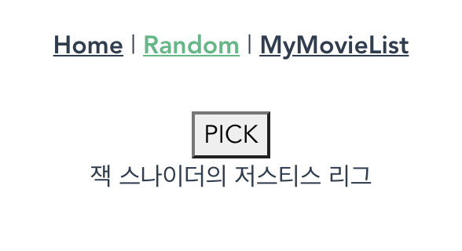
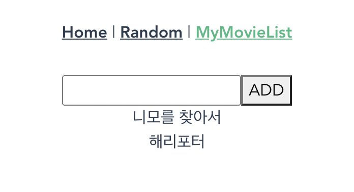

# pjt10

#### 서울 3반 이민아 21.05.14


> Vue router


> Driver : 서울 3반 조규태
>
> Navigator : 서울 3반 이민아


### 0. 구조 

### (1) 구조

- public
  - index.html **(Bootstrap CDN)**
- src
  - App.vue
  - router
    - index.js **(url 경로)**
  - views
    - Home.vue
    - MyMovieList.vue
    - Random.vue
  - components
    - MovieCard.vue (Home.vue)
    - MyList.vue (MyMovieList.vue)
    - MyListForm.vue (MyMovieList.vue)

### (2) 명령어

- [Terminal]

```javascript
npm install // 클론 코딩을 하는 경우 package.json에서 설치 (node_modules로 인해)

npm uninstall vue-cil -g // 기존 삭제
npm i -g @vue/cli // 설치
vue --version // 버젼 체크

vue create my_first_vue_app // 프로젝트생성
Default ([Vue2] babel. eslint) // 기본값 클릭
cd my_first_vue_app/ // 이동 후 실행
npm run serve // runserver

npm i lodash // lodash 설치
npm install vuex-persistedstate // 새로고침해도 정보 저장
npm i axios // axios 설치
npm install bootstrap // 부트스트랩 설치

vue add router // 라우터 설치
vue add vuex // vuex 설치

node file_name // file_name의 console 보기 가능
```

### (3) 문법

- Destructuring (`{}`)

- spread syntax ({`...object`, `key:value`})

- 컴포넌트 바인딩 헬퍼 (`mapGetters`, `mapState`, `mapActions`) 

  

### 1. router / index.js

- import component 불러오기
- path, name, component 등록

- [index.js]

```javascript
import Vue from 'vue'
import VueRouter from 'vue-router'
import Home from '../views/Home.vue'
import Random from '../views/Random.vue'
import MyMovieList from '../views/MyMovieList.vue'

Vue.use(VueRouter)

const routes = [
  {
    path: '/',
    name: 'Home',
    component: Home
  },
  {
    path: '/random',
    name: 'Random',
    component: Random
  },
  {
    path: '/mymovielist',
    name: 'MyMovieList',
    component: MyMovieList
  },
]

const router = new VueRouter({
  mode: 'history',
  base: process.env.BASE_URL,
  routes
})

export default router
```

### 

### 2. App.vue 

### 2.1 template

- router-link 의 `{name}`

- [App.vue]

```html
<template>
  <div id="app">
    <div id="nav">
      <router-link :to="{ name: 'Home', query: { movies } }">Home</router-link>
      | <router-link :to="{ name: 'Random', query: { movies } }"> Random</router-link> |
      <router-link :to="{ name: 'MyMovieList', query: { movies } }">MyMovieList</router-link>
    </div>
    <router-view />
  </div>
</template>
```

### 2.2 script

- import axios 불러오기

- data : json data 를 저장할 movies 빈 배열 초기값 
- methods : axios.get(MOVIE_URL) .then
- mounted 

- [App.vue]

```javascript
<script>
import axios from "axios";
export default {
  name: "App",
  data: function () {
    return {
      movies: [],
    };
  },
  methods: {
    getMovies() {
      const MOVIE_URL = "https://gist.githubusercontent.com/eduChange-hphk/d9acb9fcfaa6ece53c9e8bcddd64131b/raw/9c8bc58a99e2ea77d42abd41376e5e1becabea69/movies.json";
      axios.get(MOVIE_URL)
      .then((response) => {
        this.movies = response.data;
        // console.log(response);
      });
    },
  },
  mounted: function () {
    this.getMovies();
  },
};
</script>
```


### 3. views/Home.vue 

### 3.1 template

- component 보여주기 : `<MovieCard/>`
- v-for : `v-for="(movie, idx) in movies" ` `:key="idx" ` key 값 필수 v-bind
- v-bind (상위(Home.vue ) → 하위(MovieCard.vue)) : title, pster_path, overview
- Bootstrap 분할 : `<div class="row">`

- [Home.vue]

```html
<template>
  <div class="home">
    <div class="row row-cols-1 row-cols-md-5 g-4">
      <MovieCard 
        v-for="(movie, idx) in movies" 
        :key="idx" 
        :title="movie.title"
        :poster_path="movie.poster_path"
        :overview="movie.overview"
      />
    </div>
  </div>
</template>
```

### 3.2 script

- import : component 불러오기 import
- components : component 등록
- data : `this.$route.query.movies` 

- [Home.vue]

```javascript
<script>
import MovieCard from "@/components/MovieCard.vue";

export default {
  name: "Home",
  components: {
    MovieCard,
  },
  data: function () {
    return {
      movies: this.$route.query.movies
    }
  }
};
</script>
```


### 4. views/MyMovieList.vue 

### 4.1 template

- component 보여주기 : `<MyListForm/>` `<MyList />`
- v-for : `v-for="(myMovie, idx) in myMovies" ` `:key="idx" ` key 값 필수 v-bind
- v-on (하위(MyListForm.vue ) → 상위(MyMovieList.vue )) : `@my-movie="onMyMovie"`
- v-bind (상위(MyMovieList.vue ) → 하위(MyList.vue )) : myMovie

- [MyMovieList.vue]

```html
<template>
  <div>
    <MyListForm @my-movie="onMyMovie"/>
      <!-- v-for="(movie, idx) in movies" 
      :key="idx"
      :movie="movie" -->
    <MyList 
      v-for="(myMovie, idx) in myMovies"
      :key="idx"
      :myMovie="myMovie"
    />
  </div>
</template>

```

### 4.2 script

- import : component 불러오기
- components : component 등록
- data : `this.$route.query.movies` 
- data : myMovies 빈 배열 초기값 `myMovies: []`
- methods : `this.myMovies.push(myMovie)`

- [MyMovieList.vue]

```javascript
<script>
import MyListForm from "@/components/MyListForm.vue";
import MyList from "@/components/MyList.vue";
export default {
  name: "MyMovieList",
  components: {
    MyListForm,
    MyList,
  },
  data: function () {
    return {
      movies: this.$route.query.movies,
      myMovies: []
    }
  },
  methods: {
    onMyMovie: function (myMovie) {
      this.myMovies.push(myMovie)
    },

  }
};
</script>
```


### 5. views/Random.vue

### 5.1 template

- v-on 이벤트 발생시 함후 실행 `@click="randomMovie"`

- [Random.vue]

```html
<template>
  <div>
    <button @click="randomMovie">PICK</button>
    <p>{{ movie.title }}</p>
  </div>
</template>
```


### 5.2 script

- import : `import _ from 'lodash'`
- lodash 랜덤 : `this.movie = _.sample(this.movies)`
- data : `this.$route.query.movies` 
- data : movie 빈 딕셔너리 초기값 `movie: {}`

- [Random.vue]

```javascript
<script>
import _ from 'lodash'
export default {
  name: "Random",
  data: function () {
    return {
      movies: this.$route.query.movies,
      movie: {}
    }
  },
  methods: {
    randomMovie: function () {
      this.movie = _.sample(this.movies)
    }
  }
};
</script>
```


### 6. components/MyListForm.vue

### 6.1 template

- v-on 이벤트 발생시 함후 실행 `@keyup.enter="myMovie"` `@click="myMovie"`
- v-model 양방향 바인딩 (값 초기화를 위해) `v-model="movieTitle"`
  - v-model : 값 초기화 가능
  - v-bind (`:value`) : 값 초기화 불가

- [MyListForm.vue]

```html
<template>
  <div>
    <!-- :value="movieTitle" -->
    <input 
      type="text" 
      v-model="movieTitle"
      @keyup.enter="myMovie"
    >
    <button @click="myMovie">ADD</button>

  </div>
</template>
```

### 6.2 script

- data : movieTitle 빈 str 초기값 `movieTitle: ''`

- methods 

  - emit 

    하위 컴포넌트(MyListForm.vue) → 상위 컴포넌트(MyMovieList.vue) 

    `this.$emit("my-movie", this.movieTitle)`

    - 표기법 ke bab (my-movie)
    - 추가인자 (this.movieTitle)

  - input tag value 값 초기화 `this.movieTitle = ""`

- [MyListForm.vue]

```javascript
<script>
export default 
  name: "MyListForm",
  data: function () {
    return {
      movieTitle: ''
    }
  },
  methods: {
    myMovie: function () {
      this.$emit("my-movie", this.movieTitle)
      this.movieTitle = ""
    }
  }
}
</script>
```


### 7. components/MyList.vue

### 7.1 template

- [MyList.vue]

```html
<template>
  <div>{{ myMovie }}</div>
</template>
```

### 7.2 script

- props : 상위 컴포넌트(MyMovieList.vue) →  하위 컴포넌트(MyList.vue) `type: String,`
- v-bind (MyMovieList.vue )
  - v-for : `v-for="(myMovie, idx) in myMovies" ` `:key="idx" ` key 값 필수 v-bind
  - v-on (하위(MyListForm.vue ) → 상위(MyMovieList.vue )) : `@my-movie="onMyMovie"`
  - v-bind (상위(MyMovieList.vue ) → 하위(MyList.vue )) : myMovie

- [MyList.vue]

```javascript
<script>
export default {
  name: "MyList",
  props: {
    // movie: {
    //   type: Object,
    //   required: true
    // },
    myMovie: {
      type: String,
      required: true
    }
  },

}
</script>
```


### 8. components/MovieCard.vue

### 8.1 template

- v-bind image 경로

  ``

- Bootstrap 분할 : `<div class="col">`

- [MovieCard.vue]

```html
<template>
  <div>
    <div class="col mb-4">
      <div class="card">
        
        <div class="card-body">
          <h5 class="card-title">{{ title }}</h5>
          <p class="card-text">{{ overview }}</p>
        </div>
      </div>
    </div>
  </div>
</template>
```

### 8.2 script

- props : 상위(Home.vue ) → 하위(MovieCard.vue) `type: String,`
- v-bind (Home.vue)
  - v-for : `v-for="(movie, idx) in movies" ` `:key="idx" ` key 값 필수 v-bind
  - v-bind (상위(Home.vue ) → 하위(MovieCard.vue)) : title, pster_path, overview

- [MovieCard.vue]

```javascript
<script>
export default {
  name: 'MovieCard',
  props: {
    title: {
      type: String,
      required: true
    },
    poster_path: {
      type: String,
      required: true
    },
    overview: {
      type: String,
      required: true
    },
  }
}

</script>
```


### 9. 결과





